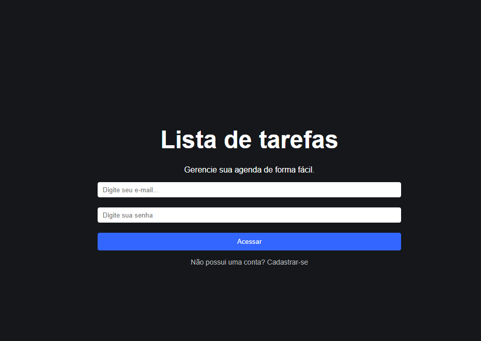
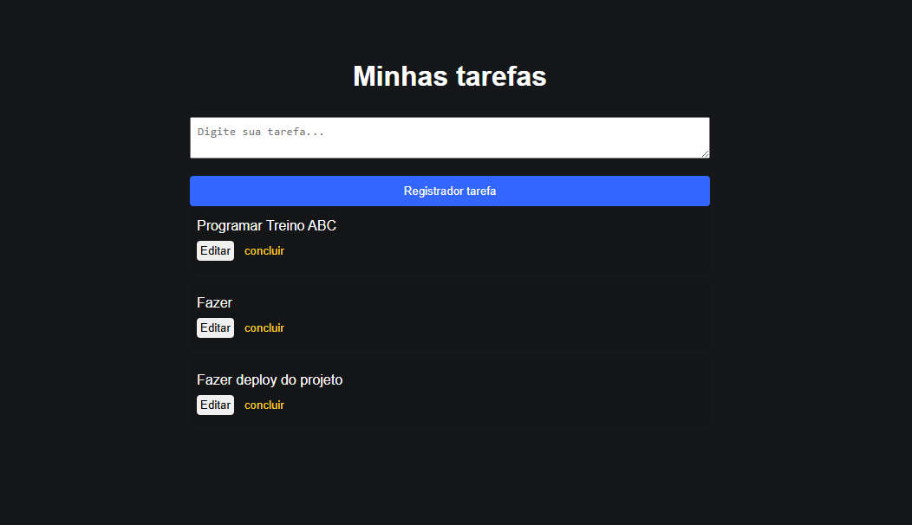
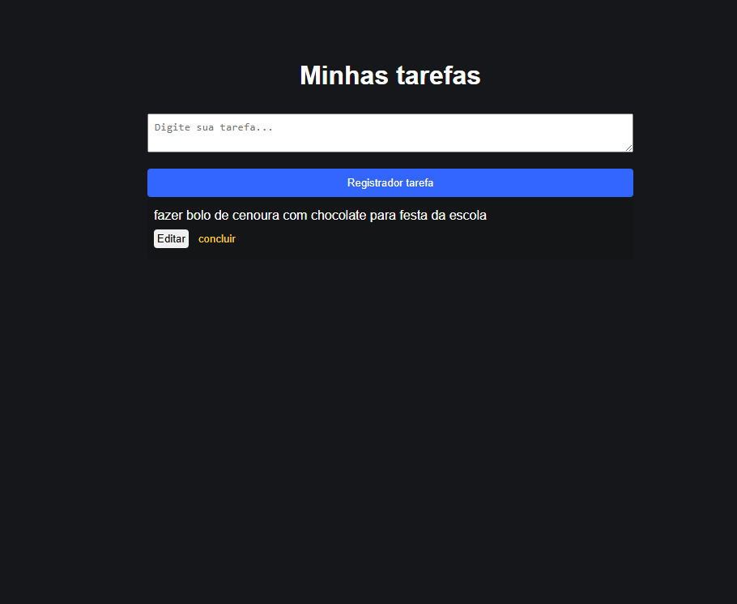

# 🚀✅ Lista de Tarefas React - Concluída ✅🚀

 <a href="#-sobre-o-projeto">Sobre</a> •
 <a href="#-funcionalidades">Funcionalidades</a> •
 <a href="#-layout">Layout</a> • 
 <a href="#-acesse-o-site-online">Acesse o Site Online</a> • 
 <a href="#-licença">Licença</a>

Projeto desenvolvido durante o curso de React da Udemy com o objetivo de praticar React, Firebase Authentication e Firestore.

## 💻 Sobre o projeto

A aplicação permite que usuários criem uma conta, façam login e gerenciem suas tarefas.

Os dados são armazenados no Firebase Firestore e a autenticação é realizada pelo Firebase Authentication.

## ⚙️ Funcionalidades

- Cadastro de usuário
- Login
- Logout
- Criar tarefas
- Editar tarefas
- Excluir tarefas

## 🎨 Layout

### Tela de Login

### Conta do Usuário 1

### Conta do Usuário 2

## 🌐 Acesse o Site Online
Você pode visualizar o projeto diretamente no navegador sem precisar baixar:

➡️ [Clique aqui para acessar](https://lista-de-tarefas-react-bay.vercel.app/) 

## Como contribuir para o projeto

1. Faça um **fork** do projeto.
2. Crie uma nova branch com as suas alterações: `git checkout -b my-feature`
3. Salve as alterações e crie uma mensagem de commit contando o que você fez: `git commit -m "feature: My new feature"`
4. Envie as suas alterações: `git push origin my-feature`
> Caso tenha alguma dúvida confira este [guia de como contribuir no GitHub](./CONTRIBUTING.md)

---

## 👨‍💻 Autor

<a href="https://br.linkedin.com/in/Joao-vitorSantos08">
João Vitor Santos souza</a>
  
 

## 📄 Licença

Este projeto esta sobe a licença [MIT](./LICENSE).

Feito por João Vitor Santos Souza👋🏽
